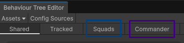
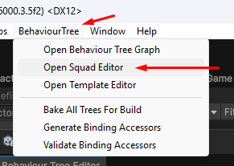
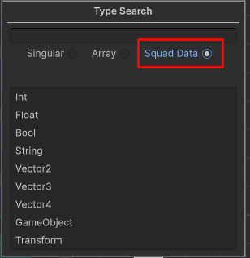
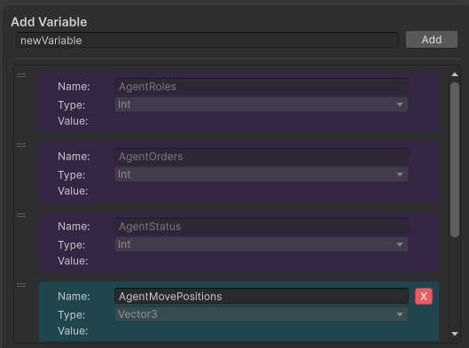
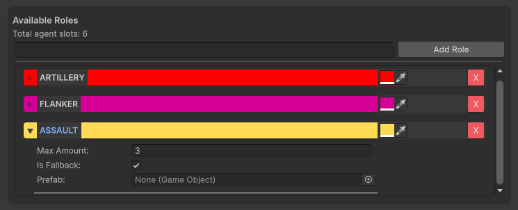
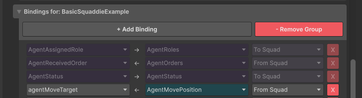
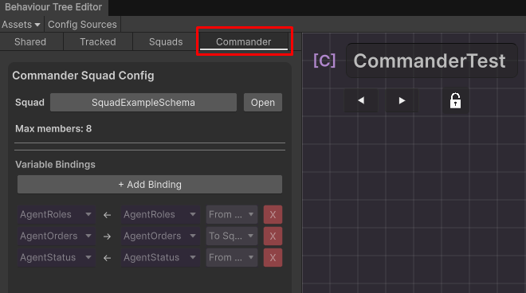
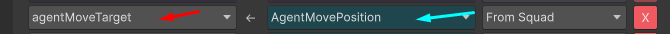
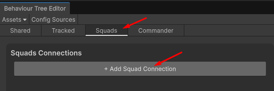
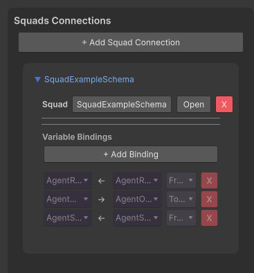

# Assignment: Wiring the Patrol Test (Preset Trees)

> **Focus: the Squad Definition Editor.** You will not build or edit any trees in this assignment — the two trees already exist. Your job is to connect them with a SquadDefinition so the squad patrols in formation.

**Preset assets (already in the project):**

| Asset | Role |
|-------|------|
| `CommanderTest` (commander tree) | Calculates formation, sends PATROL order |
| `SquaddieTest` (agent tree) | Receives order, moves to its formation slot |
| `SquadTest` (prefab) | Has the `SquadManager` component |
| `CommanderTest` (prefab) | Has the `CommanderTreeRunner` |
| `SquaddieTank` (prefab) | Has the `AgentTreeRunner` |

## Goal

Wire the preset commander tree and agent tree together through a new SquadDefinition, so that when you press Play the agents move in a circle formation from patrol point to patrol point.

---

## Step 1 — Read the trees and decide which variable to pass

Open both trees (double-click the assets) and inspect their blackboards and nodes.

**CommanderTest:**
- `ExtractPosition` reads `PatrolPoints` and writes the next waypoint into `SquadMovePosition`.
- `CalculateFormation` takes `SquadMovePosition` as the centre and writes each agent's circle position into **`AgentMovePosition`** (Vector3, SquadData — one slot per agent).
- `SendOrder` writes `PATROL` into `AgentOrders`.
- `PollAgentStatus` reads `AgentStatus`.

**SquaddieTest:**
- `CheckOrder` (expects PATROL) → `ReportStatus(Running)` → `MoveTo(target: AgentMoveTarget)` → `ReportStatus(Success)`.
- **`AgentMoveTarget`** (Vector3) is *read* by `MoveTo`, but *nothing inside the agent tree writes it*.

**Conclusion — the variable you must pass to the agent is its formation position:**

```
commander  AgentMovePosition[i]  ──►  squad  ──►  agent  AgentMoveTarget
```


So the squad definition needs **one custom variable**: `AgentMovePosition` (Vector3, **SquadData** = per-agent array). Orders, roles, status and leader index are *system channels* — you do not create those by hand; they appear automatically in Step 4.

> **The mental model — think in data first.** Before touching the editor, decide **what data needs to travel between the commander and the agents**. The two trees never talk to each other directly: the **SquadDefinition is the intermediary layer**. The commander writes to and reads from the squad blackboard; each agent writes to and reads from the squad blackboard. **Commander ↔ SquadDef ↔ Agent** — never Commander ↔ Agent.

---

## The Squads Tab vs the Commander Tab

When you open a tree asset you will see these tabs:



- **Squads tab** (blue) — present on **both** tree types. This is where you configure **which squads this tree is compatible with**: *"What squad definitions can this tree be a member of?"* A tree lists every squad it can join here as a squaddie.
- **Commander tab** (purple) — **only available on a Commander Tree**. This is where you define **which squad definition this commander controls**: *"What type of squad does this tree command?"*

In short: the **Squads tab = membership** (what squads can I join?), the **Commander tab = command** (what squad do I control?).

---

## Step 2 — Create a new SquadDefinition

1. Open the Squad Editor via the menu `BehaviourTree > Open Squad Editor`.



2. Click **Create New Squad** and save it (e.g. `PatrolSquad`).
3. In the **Blackboard section** (top), add the custom variable from Step 1:
   - Name: `AgentMovePosition`
   - Type: `Vector3`
   - **SquadData: ON** (one slot per agent — the stride is set automatically at runtime)



> **SquadData — the key concept for designers.**
> Only the **SquadDefinition** and the **commander tree** can hold SquadData variables — a SquadData variable is an **array with one slot per agent** (e.g. `AgentMovePosition[0..2]` for 3 agents).
> **Agent trees cannot hold SquadData.** An agent never sees the array — it automatically reads and writes **only its own slot** and always works with a **plain single value** (e.g. one Vector3 `AgentMoveTarget`). The slot offset comes from the agent's index in the squad and is applied for you.
> So when you design a data channel: array on the squad/commander side, single value on the agent side, and the binding bridges the two.

Do not add `AgentRoles`, `AgentOrders`, `AgentStatus` manually — those are system variables and are auto-created when you add binding groups in Step 4.


---

## Step 3 — Define the squad (roles / role composition)

In the **Roles section** (middle), click **+ Add Role**:

| Field | Value |
|-------|-------|
| Name | `ASSAULT` |
| Colour | any |
| Max Amount | `3` |
| Is Fallback | ✓ |
| Prefab | empty (falls back to the SquadManager's agent prefab) |

The sum of `Max Amount` across all roles = the total number of agent slots in the squad. Keep this number in mind — the SquadManager's `Agent Count` may not exceed it (extra agents are clamped with a warning).



---

## Step 4 — Define the tree bindings

In the **Binding Groups section** (bottom) you create one binding group per tree. A binding says: *which tree variable reads or writes which squad variable, and in which direction* (`ToSquad` = tree → squad, `FromSquad` = squad → tree).



### 4a. Commander binding group

Click **+ Add Binding Group** and select **CommanderTest**. The system bindings appear automatically:

| Squad Variable | Tree Variable | Direction |
|----------------|---------------|-----------|
| AgentRoles | AgentRoles | FromSquad |
| AgentOrders | AgentOrders | ToSquad |
| AgentStatus | AgentStatus | FromSquad |
| LeaderIndex | LeaderIndex | FromSquad |

Click **+ Add Binding** and add the custom binding for the formation position:

| Squad Variable | Tree Variable | Direction | Why |
|----------------|---------------|-----------|-----|
| AgentMovePosition | AgentMovePosition | **ToSquad** | The commander *writes* each agent's formation slot into the squad |



### 4b. Agent binding group

Click **+ Add Binding Group** and select **SquaddieTest**. The system bindings appear automatically:

| Squad Variable | Tree Variable | Direction |
|----------------|---------------|-----------|
| AgentRoles | AgentAssignedRole | ToSquad |
| AgentOrders | AgentReceivedOrder | FromSquad |
| AgentStatus | AgentStatus | ToSquad |

Click **+ Add Binding** and add the custom binding:

| Squad Variable | Tree Variable | Direction | Why |
|----------------|---------------|-----------|-----|
| AgentMovePosition | AgentMoveTarget | **FromSquad** | The agent *reads* its own formation slot — the per-agent offset is applied automatically |



> Variable names must match **exactly** (the commander's output is `AgentMovePosition`, the agent's input is `AgentMoveTarget`). A typo or a wrong direction silently results in agents that never move.





---

## Step 5 — Wire up the SquadTest prefab

Open the `SquadTest` prefab and set the **SquadManager** component fields:

| Field | Value |
|-------|-------|
| Definition | your new SquadDefinition from Step 2 |
| Commander Prefab | `CommanderTest` |
| Agent Prefab | `SquaddieTank` |
| Agent Count | `3` (≤ total role slots from Step 3) |
| Spawn On Start | ✓ |
| Leader Death Behavior | `Promote` |

**[ SCREENSHOT: the SquadManager component on the SquadTest prefab, fully assigned ]**

---

## Step 6 — Check the tree runners

Both runners must point at the correct tree assets:

1. Open the `CommanderTest` prefab → `CommanderTreeRunner` → **Authoring Asset** = `CommanderTest` (the commander tree).
2. Open the `SquaddieTank` prefab → `AgentTreeRunner` → **Authoring Asset** = `SquaddieTest`.


---

## Step 7 — Press Play and verify

Expected result:
- The commander and 3 agents spawn; agents take a circle formation around the commander.
- The formation moves from patrol point to patrol point (PATROL order).

If agents stand still, check in order:
1. Both binding groups exist and the custom bindings use the exact names from Step 4.
2. Directions: commander `ToSquad`, agent `FromSquad`.
3. Console warning about `Agent Count` being clamped (squad too small).
4. The agent actually receives the PATROL order — add a temporary `LogVariable` on `AgentReceivedOrder`.

**[ SCREENSHOT: Play mode, agents moving in circle formation ]**
