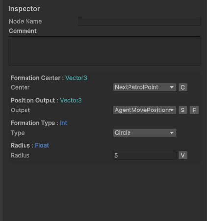

# Getting Started: Behaviour Tree Graph Editor

The Behaviour Tree Editor is a node-graph window for building and inspecting commander and agent trees. This page covers how to open it and the basic controls for navigating and editing a graph.

---

## Opening the Graph via the Top Menu

1. In the Unity **top menu bar**, go to **BehaviourTree → Open Behaviour Tree Graph**.
2. The **Behaviour Tree Editor** window opens. It starts empty — load a tree by:
   - **Selecting a tree asset** in the Project window (the window follows your selection), or
   - **Double-clicking a tree asset** (opens the window directly with that tree), or
   - **Right-clicking the empty canvas → Create New Tree → Agent Tree / Commander Tree**.

> The same top menu also holds **Open Squad Editor**, **Open Template Editor**.

---

## Basic Graph Controls

### Navigating the Canvas

| Action | Control |
|--------|---------|
| Zoom in / out | Mouse scroll wheel |
| Pan the canvas | Middle mouse button drag |
| Frame the whole tree | Automatic — the graph frames all nodes when a tree is loaded |

### Selecting and Moving

| Action | Control |
|--------|---------|
| Select a node or edge | Left click |
| Box-select multiple nodes | Left drag on empty canvas |
| Move selected node(s) | Left drag on a selected node |

### Building the Tree

| Action | Control |
|--------|---------|
| Open the context menu | Right-click on empty canvas |
| Create a node | Right-click → **Create Node** → pick from the search window |
| Create + connect in one step | Drag from a node's **output port**, drop on empty canvas → the node search opens and the new node is auto-connected |
| Connect two nodes | Drag from a parent's **output port** to a child's **input port** |
| Add a sticky note | Right-click → **Add Note** |
| Extract a subtree | Select nodes → right-click → **Subtree → Extract Selection To Subtree** (or **Copy Selection Into Subtree**) |

### Editing Shortcuts

| Action | Shortcut |
|--------|----------|
| Delete selected nodes/edges | `Delete` |
| Copy / Paste selection | `Ctrl+C` / `Ctrl+V` |
| Undo / Redo | `Ctrl+Z` / `Ctrl+Y` |
| Confirm a node rename | `Enter` |

> **Play mode:** the graph becomes read-only — it mirrors the running tree with live state visuals, and structural edits (connecting/deleting) are blocked until you exit play mode.

---

## The Graph Control Bar

The bar at the top of the graph (left to right):

- **Badge `[C]` / `[A]`** — whether the loaded tree is a **Commander** or **Agent** tree.
- **Tree name field** — edit to rename the tree asset on disk.
- **Runner dropdown** — pick a `BehaviourTreeRunnerBase` in the scene to inspect its tree (used for play-mode debugging).
- **Lock toggle** — locks the window to the current tree so clicking other assets doesn't switch it.
- **◀ / ▶ buttons** — cycle backwards/forwards through your recently opened trees.

---

## The Side Panel

The left side of the window has two areas:

### Tabs (top)

| Tab | What it shows |
|-----|---------------|
| **Shared** | The tree's **blackboard** — all variables this tree uses. Add one by typing a name in the text field, clicking **Add**, and picking a type in the popup. |
| **Tracked** | Tracked bindings — component fields pushed into blackboard variables every frame. |
| **Squads** | Which squads this tree can be a member of (both tree types). |
| **Commander** | Which squad this commander controls — only appears on **Commander trees**. |

**The blackboard** is the tree's memory: a list of named variables (positions, speeds, statuses, …) that the tree's nodes read from and write to while it runs. A node never stores data itself — it points at a blackboard variable instead. Every tree has its own blackboard, shown in the **Shared** tab; on commander trees, variables can also be marked as **SquadData** (one value per squad member) so they can be shared with the squad.

### Inspector (bottom)

Select any node in the graph and its **settings appear here** — this is where you fill in node fields (target variables, constants, etc.).

**The S / F buttons** (next to a variable dropdown):

| Button | What it does |
|--------|--------------|
| **S** (search) | Opens a search popup to find a blackboard variable **by name** — useful when the dropdown list is long. |
| **F** (filter) | Opens a type picker that changes **which variable types the dropdown accepts**. On commander trees this popup also offers the **SquadData** option (per-agent variables). |

**The C / V toggle** (on fields that accept either a constant or a variable):

The small button at the end of the row switches the field between two modes — the label shows what you'll switch *to*:

| Button | Switches to |
|--------|-------------|
| **V** | **Variable** mode — the field becomes a dropdown bound to a blackboard variable |
| **C** | **Constant** mode — the field becomes an inline value you type in |

Some fields have a third **SO** mode (C / V / SO cycling) — a **ScriptableObject config constant**, where the value comes from a config asset instead of being typed in.

---

## Assigning a Tree to a Runner

A tree asset does nothing until a **runner component** executes it:

1. Select the GameObject (or prefab) with a `CommanderTreeRunner` or `AgentTreeRunner` component.
2. Drag your tree asset into the component's **Authoring Asset** field.

The tree type must match the runner: commander trees go on `CommanderTreeRunner`, agent trees on `AgentTreeRunner`.

---

## Related

- [Getting Started: Creating a New Squad Schema](Getting_Started_SquadSchema.md)
- [Assignment: Wiring the Patrol Test](Assignment_PatrolTest_SquadWiring.md)
