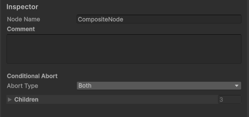
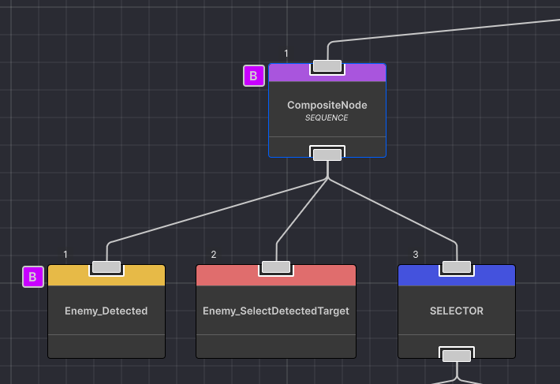

# Conditional Aborts

Aborts let a composite **interrupt** a running child branch when a condition changes. Without aborts, a SELECTOR or SEQUENCE waits for the running branch to finish before re-evaluating. With aborts, the running branch is cancelled immediately when the condition flips, and the composite restarts from the leftmost child.

## Examples when to Use Aborts

| Pattern | Abort Type | Why |
|---------|------------|-----|
| **Attack-if-in-range while patrolling** | `LowerPriority` on the root SELECTOR | If a target appears, abort patrol and attack. Resume patrolling when target is lost. |
| **Stay-in-cover while reloading** | `Self` on the cover SEQUENCE | If the cover position is no longer safe, abort and find new cover. |
| **Squad scatter on leader death** | `LowerPriority` on the root PRIORITY | As soon as LeaderIndex = -1, abort all current orders and scatter. |

---

## Abort Types

Set the **Abort Type** field on a composite node in the Inspector. Select the composite node in the graph, then find the Abort Type dropdown in the Inspector panel:



| Type | Behaviour |
|------|-----------|
| `None` | No abort checking. Default. |
| `Self` | While a branch is RUNNING, re-evaluates its **own** condition children each frame. If a condition that was SUCCESS becomes FAILURE, the running branch is **aborted** and the composite re-evaluates from the leftmost child. |
| `LowerPriority` | While a lower-priority (rightward) branch is RUNNING, checks whether any higher-priority (leftward) sibling's condition becomes SUCCESS. If so, the lower branch is aborted and the higher branch runs instead. |
| `Both` | Combines Self + LowerPriority behaviour. |

### Self Abort

Self abort re-evaluates a composite's **own conditions** every frame while a child to their right is RUNNING.

```
Frame 1:  [SEQUENCE]  abortType=Self
           ├── [🟡] IsInRange → ✅ SUCCESS
           └── [🔴] MoveTo → 🔄 RUNNING ←

Frame 50: [SEQUENCE]  abortType=Self
           ├── [🟡] IsInRange → ❌ FAILURE  ← changed!
           └── [🔴] MoveTo → 🛑 ABORTED (OnAbort called)
          → Sequence restarts from leftmost child
```

When the condition flips from SUCCESS to FAILURE, the running child is aborted via `OnAbort()` and the composite restarts from the leftmost child. This is useful for "stay here as long as it's safe" scenarios — the moment the precondition fails, the action is cancelled.

### LowerPriority Abort

LowerPriority abort checks higher-priority (leftward) sibling branches while a lower-priority (rightward) branch is RUNNING. If a higher-priority branch's condition becomes SUCCESS, the lower branch is aborted and the higher branch takes over.

```
[🔵 SELECTOR]  abortType=LowerPriority
├── [🟣 SEQUENCE] High priority
│    ├── [🟡] EnemyDetected? → changes to ✅
│    └── [🔴] Attack
└── [🟣 SEQUENCE] Low priority (currently 🔄 RUNNING)
     └── [🔴] PatrolMove
```

When `EnemyDetected?` transitions from FAILURE → SUCCESS, the PatrolMove branch is aborted and the Attack branch starts — even if PatrolMove was mid-execution. When the condition flips back (target lost), Attack fails, and the SELECTOR falls through to Patrol again.

In the graph editor, the composite with an abort type shows a small badge indicating the abort type. Here is what the LowerPriority abort looks like on a SELECTOR:



### Both

Combines Self and LowerPriority. The composite re-evaluates both its own conditions (self) and higher-priority sibling conditions (lower priority) every frame. Useful for complex trees where both types of interruption are needed.

---

## Setting Up an Abort

1. **Select the composite** (SELECTOR, SEQUENCE, or PRIORITY) in the graph editor.
2. In the Inspector, find the **Abort Type** field.
3. Choose `Self`, `LowerPriority`, or `Both`.
4. Ensure there is at least one **reachable Condition node** as a descendant of the composite (see Editor Validation below).

---

## Editor Validation

When you set an abort type other than `None`, the editor checks whether the composite has a **reachable Condition node** as a descendant. If not, a warning icon appears on the node and the Inspector shows:

> *"No reachable Condition node found. Add a Condition node as a descendant for this abort type to take effect."*

Aborts only work if there's a Condition to re-evaluate — without one, the composite has no way to detect the change that should trigger the abort.

Conditions can be:
- Direct children of the composite
- Inside child composites that have a compatible abort type (Self/Both for Self check, LowerPriority/Both for LP check)
- Inside decorators or subtrees

---

## Layout Rules

| Rule | Details |
|------|---------|
| **Self abort checks left→right** | Conditions are evaluated left to right. The first condition in document order determines the abort. |
| **LowerPriority checks left→right** | Higher-priority (left) siblings are checked first. The first one whose condition flips to SUCCESS triggers the abort. |
| **Re-evaluation scope** | Only conditions at the composite level or in child composites with matching abort types are re-evaluated. |
| **OnAbort** | When a branch is aborted, the running node's `OnAbort()` method is called (e.g., MoveTo calls `agent.isStopped = true`). |

---

## Abort vs PRIORITY

Both aborts and PRIORITY can interrupt running branches, but they work differently:

| Mechanism | How it works | Best for |
|-----------|-------------|----------|
| **LowerPriority abort** on SELECTOR/SEQUENCE | Re-evaluates condition children. The branch is aborted **only when the condition transitions** (e.g. FAILURE → SUCCESS). | Condition-driven interruption: "interrupt patrol when an enemy is detected" |
| **PRIORITY** | Re-evaluates all children every frame regardless. If any higher-priority child returns SUCCESS, lower priority children are interrupted. | Always-on interruption: "leader death scatter must preempt everything, every frame" |

In practice, PRIORITY is more aggressive (it checks every child every frame) while LowerPriority abort is more efficient (it only checks when conditions change).
