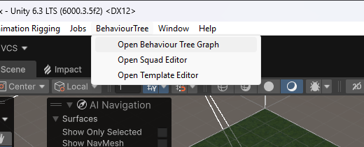
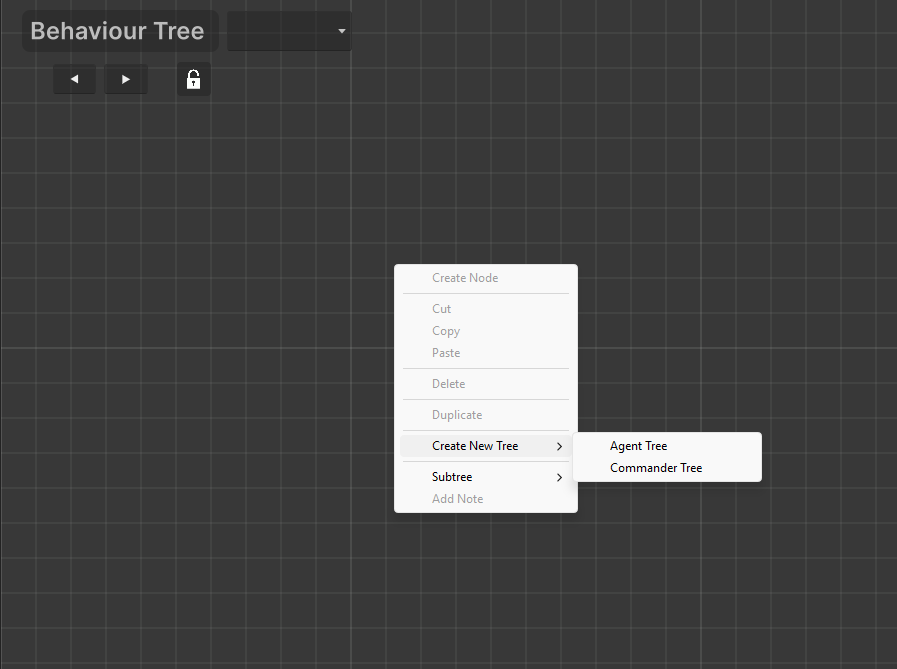
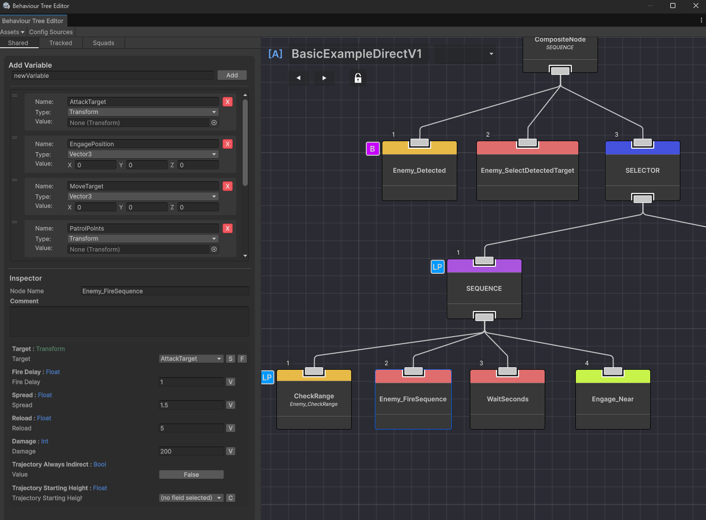
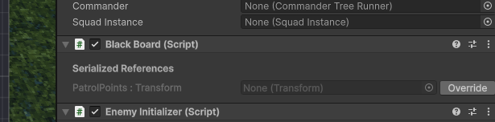
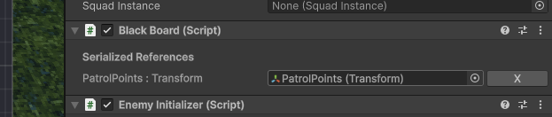
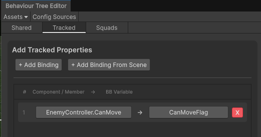
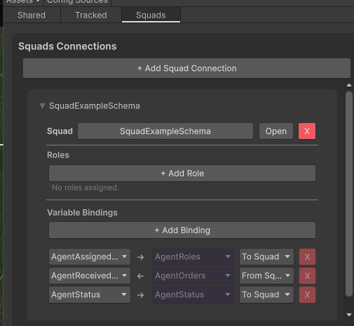
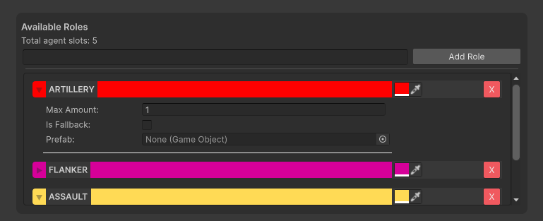
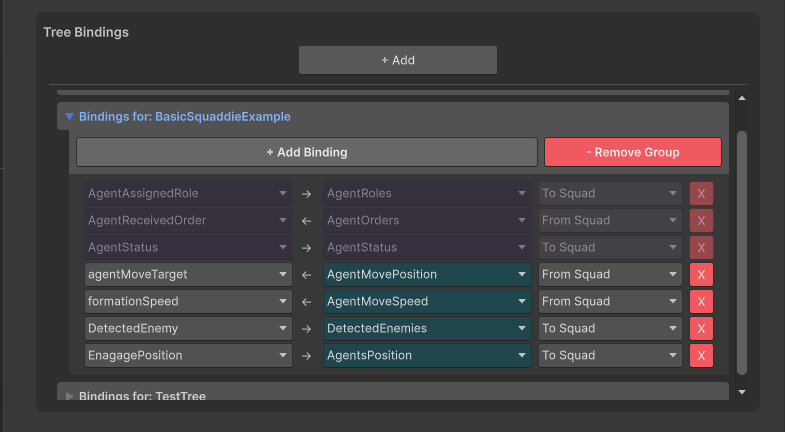

# Getting Started with Behaviour Trees

## Accessing the Tools

There are two ways to access the Behaviour Tree editor and its tools:

### Via the Top Menu

Open any editor window from the Unity top menu bar: `BehaviourTree >` then choose:



| Menu Item | What it does |
|-----------|-------------|
| `Open Behaviour Tree Graph` | Opens the main graph editor. From here you can create new tree assets via the toolbar. |
| `Open Squad Editor` | Opens the Squad Definition editor for configuring squads. |
| `Open Template Editor` | Opens the Blackboard Template editor for reusable variable sets. |

### Via Asset Creation

Create tree assets and related ScriptableObjects in the Project window:

- `Assets > Create > BehaviourTree` in the menu bar
- Or **right-click** in the Project window → `Create > BehaviourTree`



Both show the same list of assets you can create:

| Menu Item | Creates | Description |
|-----------|---------|-------------|
| `Agent Tree` | Agent Tree Asset | A behaviour tree for a single enemy/agent. Has one blackboard. |
| `Commander Tree` | Commander Tree Asset | A behaviour tree for a squad commander. Has an additional commander blackboard for per-agent arrays. |
| `Blackboard Template` | Blackboard Template | A reusable variable set that can be applied to multiple tree blackboards. |
| `Order Registry` | Order Registry | Defines the list of order names used by `SendOrder` and `CheckOrder`. |

> **Squad Definition** is created from the Squad Editor window (`BehaviourTree > Open Squad Editor` → "Create New Squad" button), not from the `Assets > Create` menu.

Once you have a tree asset, **double-click** it to open the graph editor.

## The Editor Layout

The Behaviour Tree Editor window is split into two main areas:

### Graph View (right side)

This is where you build your tree visually. Nodes are placed as boxes connected by lines. Use the mouse to pan, scroll to zoom, and drag from output ports to input ports to connect nodes. Right-click or press **Space** to open the node creation menu.



### Inspector Panel (left side)

The left panel has two sections:

**Node Inspector** — shows the selected node's configurable fields (see [What's Inside a Node](#whats-inside-a-node) below).

**Tab bar** — below the node inspector, three tabs switch between different views:

| Tab | What it shows |
|-----|---------------|
| **Shared** | The tree asset's blackboard variables. Add, remove, and configure variables here. |
| **Tracked** | Tracked property bindings — map a public field from a scene GameObject's component into a blackboard variable (see [Tracked Properties](#tracked-properties) below). |
| **Squads** | Squad connections for linking this tree to a squad (agent trees only — see the Commander & Squad guide). |

The **Shared** tab shows the blackboard — every tree has one. Variables created here can be referenced by node fields (via Variable dropdowns) and overridden per-instance on scene GameObjects.

The **Squad** tab is visible on both agent and commander trees. It manages connections to SquadDefinitions. The **Commander** tab appears only on commander tree assets and selects which squad the commander commands. Both are explained in depth in the [Commander & Squad guide](file:///d:/Dev/TreeCommanderTest/Commander_Getting_Started.md).

---

## Building a Basic Tree

### Adding Nodes

Right-click anywhere in the graph (or press **Space**) to open the node creation menu. Nodes are grouped:

| Group | What's inside |
|-------|---------------|
| **Composites** | SELECTOR, SEQUENCE, PARALLEL, PRIORITY — control flow |
| **Methods** | All actions (🔴) and conditions (🟡) — the actual behaviour |
| **Decorators** | INVERTER, REPEATER — modify child results |
| **Subtrees** | Other tree assets you can embed |

### Connecting Nodes

Each node has an **output port** (circle at the bottom) and an **input port** (circle at the top).

1. Drag from a node's **output** port.
2. Drop onto another node's **input** port.

A root node is always present. Everything connects below it.

### Typical Structure

```
[🟢 ROOT]
   │
   └── [🔵 SELECTOR]     ← tries children left→right
         │
         ├── [🟣 SEQUENCE]    ← attack branch
         │    ├── [🟡] Enemy_Detected
         │    └── [🔴] Enemy_FireSequence
         │
         └── [🟣 SEQUENCE]    ← patrol branch
              ├── [🔴] ExtractPosition
              └── [🔴] MoveTo
```

---

## What's Inside a Node

Select a node to show its fields in the Inspector. Each field has a label, type, and an input area. Fields come in several kinds:

### Variable (V)
A dropdown to pick a **blackboard variable**. Only variables with the right type are shown.

```
 ┌──────────────────────────────────────────────┐
 │  Target : Transform                          │
 │  ┌────────────────────────────────────────┐  │
 │  │ selectedTarget          ▼  [S] [F]    │  │
 │  └────────────────────────────────────────┘  │
 └──────────────────────────────────────────────┘
```

Two small buttons appear next to the dropdown:

| Button | Tooltip | What it does |
|--------|---------|-------------|
| **S** | "Search for a variable by name" | Opens a search popup — type to filter. Useful when you have many variables. |
| **F** | "Change the variable type filter" | Opens a type picker to change which types are shown. Only appears on fields that accept multiple types (e.g. `Transform/GameObject/Vector3`). |

### Constant (C)
A regular input box — number, toggle, colour, vector, or object field depending on the type.

```
 ┌──────────────────────────────────────────────┐
 │  Spread     ┌────────────────────────────┐   │
 │             │ 0.5                        │   │
 │             └────────────────────────────┘   │
 └──────────────────────────────────────────────┘
```

### Toggle (C / V)
A **C** / **V** button switches between constant and variable mode.

| Button shows | You're in | Click to switch to |
|-------------|-----------|-------------------|
| **C** | Variable mode | Constant mode |
| **V** | Constant mode | Variable mode |

### Operation
A dropdown of operations (e.g. LessThan, Random, Sequential).

### ScriptableObject Constant (C / V / SO)
A three-way toggle. In **SO** mode you pick a field from a ScriptableObject config source. The button cycles **C → V → SO → C → ...**.

---

## Removing Nodes and Connections

- **Select a node** and press **Delete** to remove it.
- **Select a connection** (click the line) and press **Delete** to remove just that connection.
- **Drag a new connection** from a port to replace the existing one.

---

## The Blackboard

The blackboard is the tree's shared memory — variables defined here can be read and written by any node.

### Adding a Variable

In the Blackboard panel (right side of the editor):
1. Type a name in the text field at the bottom.
2. Click **+** or press Enter.
3. A popup opens — pick a **type** (int, float, bool, Vector3, Transform, etc.).
4. The variable appears in the list. You can rename it, change its type, or delete it.

### What Variables Are For

| Variable type | Common uses |
|--------------|-------------|
| `Vector3` | Patrol positions, movement targets |
| `Transform` | Enemy targets, patrol point parents |
| `float` | Health, speed, timers |
| `int` | Agent index, order IDs, ammo count |
| `bool` | Status flags, detection state |

### How Nodes Use Variables

A node field can either hold a **constant value** (typed directly) or **reference a variable** (picked from a dropdown). When a node writes to a variable, any node reading that variable sees the new value next frame.

For example:
- `ExtractPosition` **writes** a patrol position to `targetMovePosition`
- `MoveTo` **reads** `targetMovePosition` to know where to go

### Blackboard Properties

Each variable has:

| Property | Meaning |
|----------|---------|
| **Name** | Used by nodes to reference the variable |
| **Type** | int, float, bool, Vector2/3/4, Transform, GameObject, Color, Enum |
| **Stride** | 1 (single value) or > 1 (array — used by commander squad-data) |
| **SquadData** | (Commander only) Stride adjusts to squad size at runtime |

---

## Assigning the Tree to a GameObject

1. Add the appropriate runner component to the GameObject:
   - **Agent tree**: `AgentTreeRunner` component
   - **Commander tree**: `CommanderTreeRunner` component
2. The `BlackBoard` component is added automatically.
3. Drag the tree asset into the **Authoring Asset** field on the runner.
4. The blackboard builds its variable slots automatically — you can override values per-instance in the Inspector.

---

## Overriding Blackboard Values Per-Instance

On the scene GameObject's `BlackBoard` component Inspector, each variable can be overridden:

- **Reference types** (Transform, GameObject, Component): each variable shows an object field with a **✓** checkbox. Check the box to enable the override, then drag a scene object into the field.
- **Value types** (int, float, bool, Vector2/3/4, Color, enum): the override value appears as a regular input field. Change it to override the asset's default for this specific instance.

Unchecking the box clears the override but keeps the value stored — checking it again restores the previous override.

  

Overrides are stored **by variable name**, not by slot index. Renaming a variable in the asset remaps existing overrides automatically. Adding or removing other variables does not affect them.

---

## Tracked Properties

Tracked Properties let you push a value from a component's public field or property on a scene GameObject into a blackboard variable **every frame**. This is useful for reading live data from the GameObject (e.g. health, position, speed) and using it inside your behaviour tree.

### Adding a Tracked Binding

In the **Tracked** tab of the editor (below the node inspector):

1. Click **+ Add Binding** to create a new tracked binding row.
2. Assign:
   - **Target Component** — drag a scene GameObject with the component that has the field you want to read.
   - **Field/Property** — a dropdown of all public fields and properties on that component. Pick the one whose value you want to push into the blackboard.
   - **Blackboard Variable** — a dropdown of matching blackboard variables. Pick the variable to receive the value each frame.



### How it works at runtime

Each frame, before the tree evaluates, the runner reads the component's field/property value and writes it into the target blackboard variable. The value is available to nodes during that frame's evaluation.

- **Supported types**: int, float, bool, Vector2, Vector3, GameObject, Transform, enum
- **Type mismatch**: the field's type must match the blackboard variable's type — incompatible types are filtered out of the dropdown
- **Performance**: the field/property access is resolved once (cached via reflection), then a simple read + write happens each frame

### Use cases

| Scenario | Component field | Blackboard variable | Why |
|----------|----------------|---------------------|-----|
| Enemy speed | `NavMeshAgent.speed` | `AgentMoveSpeed` (float) | Commander reads agent speeds for formation keeping |
| Player detection | `EnemyDetectionSystem.hasTarget` | `HasTarget` (bool) | Condition node checks if a target is present |
| Agent position | `Transform.position` | `AgentPosition` (Vector3) | Commander computes distances for regroup logic |
| Health tracking | `HealthComponent.currentHP` | `CurrentHealth` (int) | Agent tree decides when to flee or heal |

### Difference from Squad Bindings

Tracked bindings push **from a component on a scene GameObject** into a **blackboard variable**. Squad bindings push **between the squad blackboard and a tree's blackboard** — they are a different system. Both are evaluated each frame and can coexist.

---

## The Squad Tab

The **Squad** tab (below the node inspector) manages connections between this tree and squads. When you connect an agent or commander tree to a SquadDefinition, the tab shows the **variable bindings** — the mappings between the squad's blackboard variables and this tree's blackboard variables.

### Adding a Squad Connection

Click **+ Add Squad Connection** and pick a SquadDefinition. The connection is created and system bindings are auto-created for AgentRoles, AgentOrders, AgentStatus, and LeaderIndex.



### Role Selection

When connecting an agent tree to a squad, you can optionally assign which roles this agent can play. The SquadManager uses this to determine which agents get which role.



### The Binding Rows

Each connection expands to show its bindings — one row per variable mapping:



Each row has:

| Field | Description |
|-------|-------------|
| **Squad Variable** | A variable on the squad's blackboard (dropdown) |
| **Tree Variable** | A variable on this tree's blackboard (dropdown) |
| **Direction** | `ToSquad` (tree → squad), `FromSquad` (squad → tree), or `Both` |

### System vs Custom Bindings

- **System bindings** (AgentRoles, AgentOrders, AgentStatus, LeaderIndex) are auto-created when the connection is first made. They appear with an orange highlight and cannot be removed — they provide the core communication channels for orders, roles, and status.
- **Custom bindings** can be added via the **+ Add Binding** button. Use these for additional per-agent data like movement targets, formation positions, or custom status values.

### Direction

The direction controls which way data flows:

| Direction | Data flow | Use case |
|-----------|-----------|----------|
| `ToSquad` | Tree → Squad | Agent writes its status to the shared squad array |
| `FromSquad` | Squad → Tree | Agent reads what order was assigned to it |
| `Both` | Squad ↔ Tree | Both sides read and write the same variable (e.g. formation positions) |

> A full walkthrough of setting up squads, roles, and commanders is in the [Commander & Squad guide](Assignment/Commander_Getting_Started.md).

## Editor Controls Reference

| Key / Action | What it does |
|-------------|-------------|
| **A** | Frame all nodes (fit tree on screen) |
| **Ctrl+Z** | Undo |
| **Ctrl+Y** | Redo |
| **Right-click** / **Space** | Open node creation menu |
| **Drag from port** | Connect nodes (output → input) |
| **Left-click** node | Select and show properties |
| **Delete** | Delete selected node or edge |
